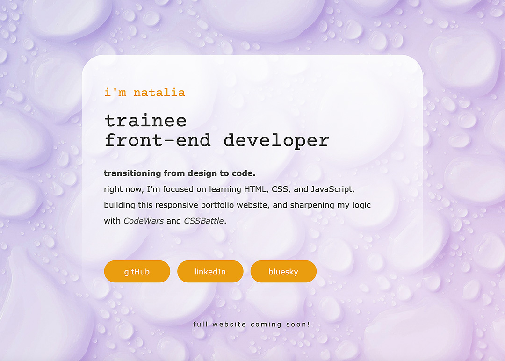

# One-Page Portfolio

A minimalist and responsive personal portfolio website built with HTML and CSS.

## Features & Highlights
- Custom fonts with Google Fonts (Courier Prime, Send Flowers)

- Subtle background animation using @keyframes and linear-gradient

- Floating container animation

- Fully responsive design with multiple media queries

- Hover interactions on links and buttons

- Flexbox layout

- Image layering with pseudo-elements (::before) and z-index

## 🔗 [Live Demo](https://kolonatalie.github.io/portfolio/)

## 📌 Note  
This project is part of my **learning a responsive portfolio** — more updates and improvements to come!
