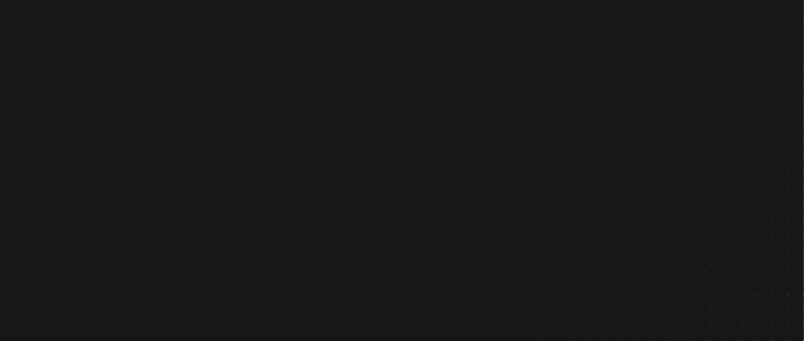
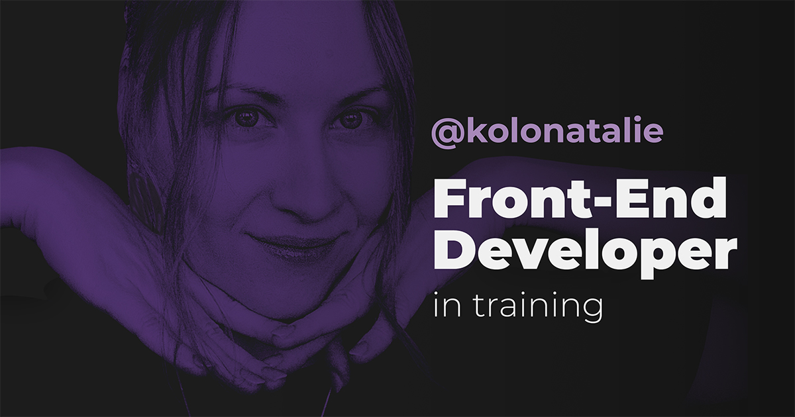

# Personal Portfolio Website — [Visit](https://kolonatalie.github.io/portfolio/)

The site is built with semantic HTML, modern CSS (including animations, custom properties, and responsive layouts), and a focus on accessibility.

## Notable Features

- Fully functional **reviews carousel** and a **responsive navigation toggle** using pure JavaScript
- Prioritized **semantic HTML5 tags** (`<nav>`, `<main>`, `
` ) and `aria` **attributes** (`aria-label`)
- **Custom Properties (CSS Variables):** for colors, spacing, typography, and animations.

- **Text Balance & Clamp:** `text-wrap: balance` and `clamp()` for adaptive typography.

- **Radial Grid Background:** using `radial-gradient` + `mask` for a layered, dimensional effect.

- **Staged Animations:** Used CSS `@keyframes` to create smooth, staggered fade-in animations that progressively reveal content

- **Marquee Animation:** subtle horizontal text scroll for personality.

## 🔗 [Live Demo](https://kolonatalie.github.io/portfolio/)

## 🤝 Open for Collaboration
I’m not just looking for jobs — I’m open to **creative collaborations, learning projects, hackathons, and design-to-code partnerships.**
If you enjoy mixing creativity with code, let’s connect.

- **[LinkedIn](https://www.linkedin.com/in/kolonatalie/)** 
- **[GitHub](https://github.com/kolonatalie)** 
- **[Bluesky](https://bsky.app/profile/kolonatalie.bsky.social)**
- **[Mastodon](https://mastodon.social/@kolonatalie)**

## 📌 Note  
This portfolio will continue to evolve as I improve my skills and experiment with new front-end technologies.

