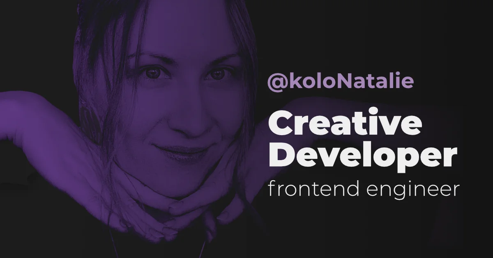

[](https://kolonatalie.vercel.app)


# Creative Developer Portfolio — [Live Demo](https://kolonatalie.vercel.app)

[](https://sonarcloud.io/summary/new_code?id=kolonatalie_portfolio)
[](https://sonarcloud.io/summary/new_code?id=kolonatalie_portfolio)
[](https://sonarcloud.io/summary/new_code?id=kolonatalie_portfolio)


-hotpink?style=for-the-badge&logo=sass&logoColor=white)

A high-performance, motion-driven portfolio platform engineered with **React 18**, **TypeScript**, and **GSAP**. 97 Performance score on PageSpeed Insights.

> *Successfully migrated from a Vanilla JS implementation to a robust React + TypeScript architecture to improve scalability and maintainability.*  

## Key Highlights (2026 Update)

* Developed a custom `useScrollReveal` hook using **GSAP ScrollTrigger**, featuring a data-driven system for staggered reveals and complex motion paths.
* Custom-built "Magnetic" components, high-end "Back to Top" navigation with **Lenis Smooth Scroll**, and developed custom `useSound` hook
* Scalable **SASS Modules (7-1 pattern)** with a centralized design system using CSS Variables.
* **Strict TypeScript** implementation across all components, hooks, and GSAP animation targets for **maximum maintainability**.
* **GPU-Accelerated Motion.** Optimized animation layers using `will-change` and `contain` properties, ensuring a steady 60fps even with complex GSAP timelines.
* Optimized asset delivery achieving a **97 Performance score** on PageSpeed Insights. [Full report](https://pagespeed.web.dev/analysis/https-kolonatalie-vercel-app/3e0yb32bso?form_factor=mobile)


## Project Structure

```text
src/
├── assets/      # Optimized assets (WebP images, audio, fonts)
├── components/  # Atomic UI (Buttons, Icons) & Layout (Header, Footer)
├── data/        # Centralized project & experience metadata
├── hooks/       # Custom engines: useScrollReveal, useSound, useFormValidation
├── pages/       # Main page, blog page, links page, now page, 404.
├── styles/      # Global SCSS (Sass 7-1: variables, mixins, reset)
└── utils/       # Math helpers & animation constants
````
## Tech Stack

* Core:  **React 18 • TypeScript 5 • Vite**
* Motion: **GSAP 3 • @gsap/react • ScrollTrigger • Lenis (Smooth Scroll)**
* Styles: **SASS Modules • HSL • PostCSS**
* Quality:  **ESLint 9 • Stylelint • Husky**


## Installation
```Bash
# Clone the repository
git clone https://github.com/kolonatalie/portfolio

# Install dependencies
npm install --legacy-peer-deps

# Start development server
npm run dev
```
> ***Note:** `--legacy-peer-deps` is required for ESLint 9 compatibility with some plugins.*


## Available Scripts
|  |  |
| :--- | :--- |
|`npm run dev`| Starts Vite dev server at `http://localhost:3000` |
|`npm run build`| Runs Type-check (`tsc`) and builds the project with Vendor Splitting (React, GSAP into separate chunks).|
|`npm run preview`| Locally previews the production build|
|`npm run lint`| Audits JS/TS and SCSS for errors.|
|`npm run lint:fix` | Automatically fixes linting and styling issues.|

---

## Connect with Me

I'm always open to discussing creative technology, motion design, or potential collaborations.

[](https://www.linkedin.com/in/kolonatalie/)
[](https://x.com/dev_kolonatalie)
[](https://bsky.app/profile/kolonatalie.bsky.social)
[](https://mastodon.social/@kolonatalie)
[](https://github.com/kolonatalie)


## Note  
This portfolio is a living lab where I experiment with advanced GSAP techniques, Three.js, and shaders. It evolves as I push the boundaries of what's possible on the web.


